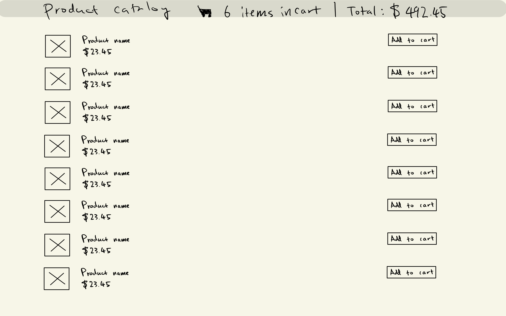
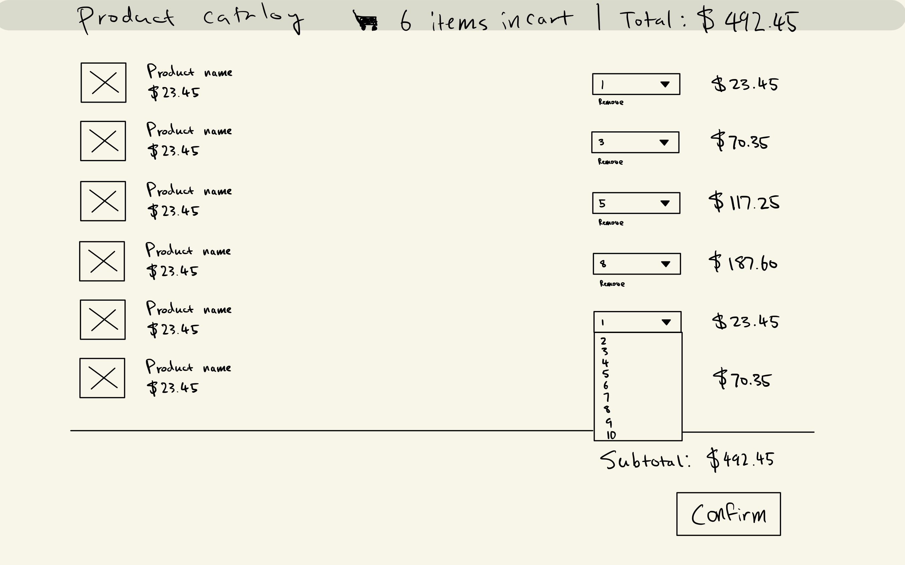
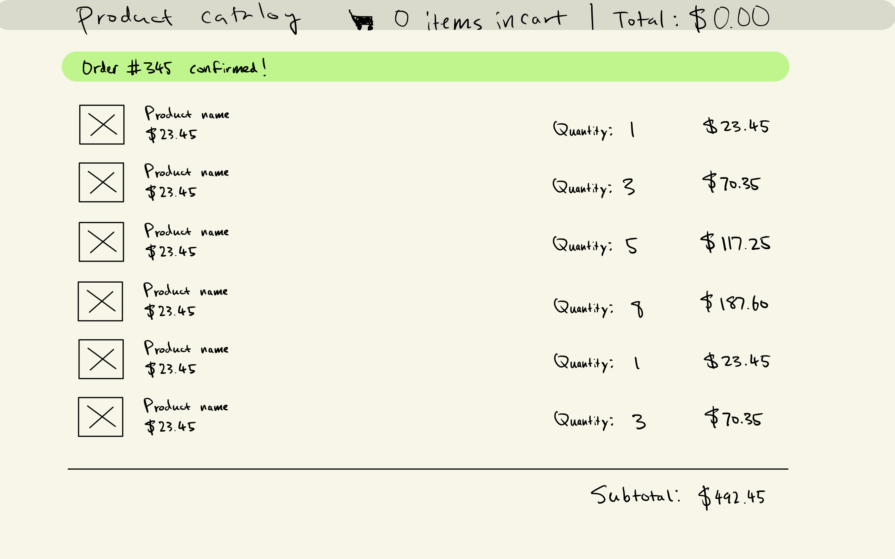

# Odeko Checkout interview project

## Project description

Implement an online checkout flow. We started the frontend app. You can find
some info on how to use it in [the original readme][cra] generated by
create-react-app. You'll need Yarn and a relatively recent version of Node.js.

We implemented the backend server for you. We'll send you a link to your account
where you can create an API key. Keep it secure!

You can choose between using the HTTP or GraphQL endpoints. They're functionally
identical.

- [Interactive HTTP docs](https://secret-shore-94903.herokuapp.com/api-docs)
- [Interactive GraphQL docs](https://secret-shore-94903.herokuapp.com/graphiql)

## Instructions

- You must use React for this project, but feel free to add, replace, or redo
  anything else you'd like.
- We will be reviewing your solution commit-by-commit so that we can understand
  your thought process. So instead of putting everything in a single giant
  commit, make frequent cohesive commits so we can see what your work
  progression looks like.
- Don't spend more than 3 hours on this project. It's okay if you don't finish
  all of the [feature requirements](#feature-requirements). If you do decide to
  use more time, let us know what you worked on before and after those 3 hours.
- Leave comments in places where you weren't quite sure if you were solving the
  problem correctly to let us know that you've thought about it and made a
  conscious decision.
- Provide working instructions for how to run your application, and make sure
  that the application will run on someone else's machine.
- Fulfill the [feature requirements](#feature-requirements) below. Let us know
  when you're done and open a PR for review. Good luck!

## Mockups

| Page                                  | Description             |
|---------------------------------------|-------------------------|
|    | Product catalog page    |
|       | Cart page               |
|  | Order confirmation page |

## Feature Requirements

- [ ] A page displaying the list of products
    - [ ] Image
    - [ ] Name
    - [ ] Price
    - [ ] Add to cart button
- [ ] A page displaying the cart
    - [ ] List of items in the cart
        - [ ] Image
        - [ ] Name
        - [ ] Price
        - [ ] Quantity dropdown
            - [ ] Setting to 0 removes the item from cart
            - [ ] Setting to any other number updates the "Line item total"
        - [ ] `Remove` button
        - [ ] Line-item total (Quantity × Cost)
    - [ ] Total
    - [ ] Confirmation button
- [ ] A confirmation page
    - [ ] List of items in cart
    - [ ] Total
    - [ ] Success message
- [ ] A navigation bar on all pages
    - [ ] Link to Product catalog
    - [ ] Link to Cart
    - [ ] Number of items in cart
    - [ ] Total cost of items in cart

## Misc

- To authenticate with the API, you must set the `Authorization` header
    - `Authorization: Token $YOUR_TOKEN`
- To authenticate with Swagger (HTTP docs), press the `Authorize` button
    - Enter `$YOUR_TOKEN`
- To authenticate with GraphiQL (GraphQL docs), press the `REQUEST HEADERS`
  button at the bottom of the page
    - Enter `{ "Authorization": "Token $YOUR_TOKEN" }`
- This repo was created with [create-react-app][cra]

[cra]: ./CREATE_REACT_APP.md
